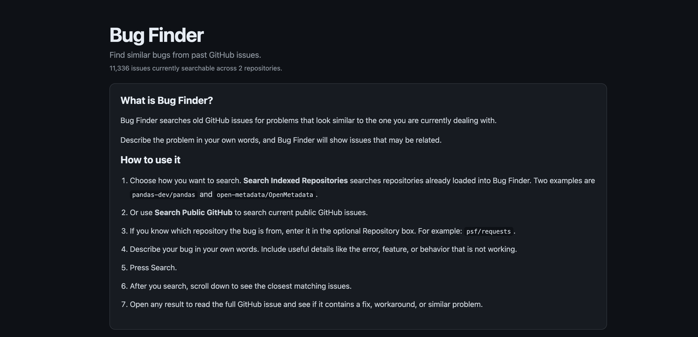
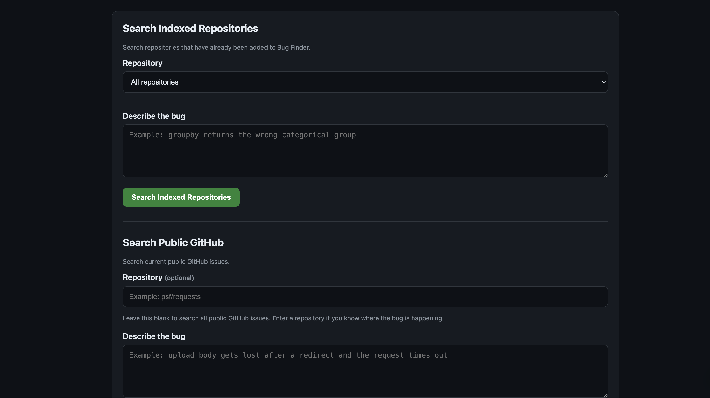
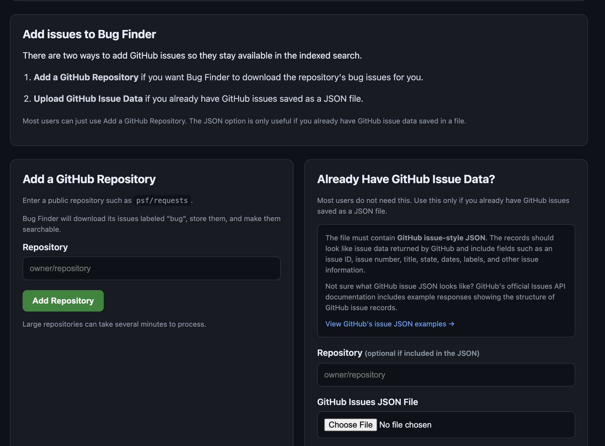

# GitHub Bug Finder

GitHub Bug Finder lets you describe a coding bug in your own words and search for GitHub issues that look similar.

I built it because I kept searching through old GitHub issues whenever I ran into an error, and keyword search was not always enough. The wording in an issue can be completely different from how I would describe the same problem.

## What It Does

Bug Finder supports two search modes:

- **Indexed search** — searches GitHub issues already stored in PostgreSQL.
- **Live GitHub search** — searches current public GitHub issues through the GitHub API and reranks the results.

It can also add more issue data by downloading bug-labeled issues from a public repository or by importing GitHub issue-style JSON.

## Screenshots

### Home



### Search



### Add issue data



## How the Search Works

For indexed repositories, issue text is stored in PostgreSQL and embedded with `all-MiniLM-L6-v2`. A bug description is compared with the stored issues and the closest matches are ranked.

For live GitHub search, the app:

1. builds a few short GitHub searches from the bug description
2. collects possible issue matches
3. removes duplicates
4. compares the full description with each issue
5. reranks the best results

The current reranking score uses:

- 85% semantic similarity
- 15% title word overlap

The goal is not to claim that an issue is definitely the fix. It is to move useful old reports closer to the top so they are faster to find.

## Data Used

The main indexed test data contains:

- `open-metadata/OpenMetadata` — 1,824 bug issues
- `pandas-dev/pandas` — 9,512 bug issues

That gives **11,336 indexed issues** across the two repositories.

## Evaluation

I tested indexed search with 20 manually written bug descriptions across pandas and OpenMetadata. The descriptions were paraphrased instead of copied directly from issue titles.

| Search Method | Hit@1 | Hit@5 | Hit@10 | MRR@10 |
|---|---:|---:|---:|---:|
| Semantic search | 70% | 90% | 90% | 0.783 |
| Semantic + title reranking | **80%** | **100%** | **100%** | **0.868** |

`Hit@5 = 100%` means the correct issue appeared somewhere in the first five results for every test query.

The benchmark is small, so I treat it as a useful project test rather than proof that the ranking will work the same way on every repository.

## Example

For this bug description:

> upload body gets lost after a redirect and the request eventually times out

with the repository set to `psf/requests`, the issue I was looking for appeared at rank **#5**. The results above it were also related to redirects, request bodies, and timeouts.

## How to Run It Locally

### 1. Clone the repository

```bash
git clone https://github.com/ryanleem/github-bug-finder.git
cd github-bug-finder
```

### 2. Install the Python packages

```bash
python3 -m pip install -r requirements.txt
```

On Windows, if `python3` is not recognized, use:

```powershell
py -m pip install -r requirements.txt
```

### 3. Install PostgreSQL

Bug Finder uses PostgreSQL for indexed issue data.

#### macOS

With Homebrew:

```bash
brew install postgresql@17
brew services start postgresql@17
```

#### Windows

Download and install PostgreSQL from the official PostgreSQL Windows installer. During setup, remember the username, password, and port you choose. The default port is usually `5432`.

After installation, PostgreSQL can be managed through **pgAdmin** or the PostgreSQL command-line tools installed with it.

#### Ubuntu / Debian Linux

```bash
sudo apt update
sudo apt install postgresql postgresql-contrib
sudo systemctl enable --now postgresql
```

#### Fedora / RHEL Linux

```bash
sudo dnf install postgresql-server postgresql-contrib
sudo postgresql-setup --initdb
sudo systemctl enable --now postgresql
```

Before running the app, make sure the database settings near the top of `app/main.py` match your local PostgreSQL setup.

The project also needs the tables and indexes defined in the SQL files under `database/`.

### 4. Optional: set a GitHub token

Live GitHub search works without a token, but authenticated requests have a higher API rate limit.

macOS / Linux:

```bash
export GITHUB_TOKEN="your_token_here"
```

Windows PowerShell:

```powershell
$env:GITHUB_TOKEN="your_token_here"
```

Do not commit your token to the repository.

### 5. Start the app

macOS / Linux:

```bash
python3 -m uvicorn app.main:app --reload
```

Windows:

```powershell
py -m uvicorn app.main:app --reload
```

Then open:

```text
http://127.0.0.1:8000
```

## Tech Used

- Python
- SQL
- PostgreSQL
- pgvector
- sentence-transformers
- FastAPI
- Jinja2 / HTML
- GitHub REST API

## Project Structure

```text
app/          FastAPI app and HTML template
data/         issue data used by the project
database/     SQL tables, features, and indexes
docs/         project notes
evaluation/   search evaluation work
queries/      SQL analysis queries
scripts/      ingestion and processing scripts
assets/       screenshots
```

## Current Limitations

- Live search is limited by the GitHub API rate limit.
- Large repositories take longer to download and embed.
- Search results are possible matches, not guaranteed fixes.
- The manual evaluation set is still small.
- Local PostgreSQL setup still requires some manual configuration.

## Why I Made It

This started as a SQL project built around public GitHub bug data. I collected issues, stored them in PostgreSQL, and wrote queries to study the data.

I eventually wanted the database work to lead to something I would actually use, so I built search on top of it. The project grew into a mix of SQL, vector search, API work, evaluation, and a small web app.

The problem is simple: when I hit a bug, I want to know whether someone has already reported something similar. Bug Finder is my attempt to make that search quicker.